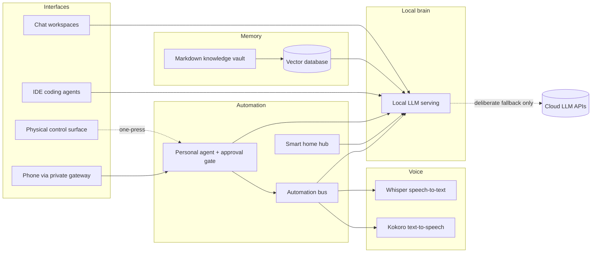
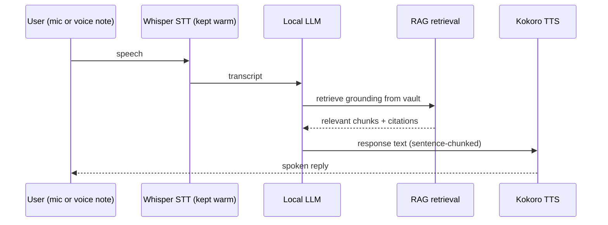

## Why a lab

A self-hosted, local-first AI ecosystem built around open-source models, designed to be used every day rather than admired. It has two jobs: replace most paid AI subscriptions with local equivalents (keeping one cloud API as a deliberate fallback for frontier-quality work), and serve as a hands-on study in AI platform engineering - the serving, memory, voice, automation, and governance layers that hosted products hide.

## The constraint that shapes everything

The whole platform runs on one consumer workstation with a single 12 GB GPU and 64 GB of system RAM. That constraint drives the engineering:

- **Quantization as a first-class tool.** Models run as GGUF quantized builds, with the quant level chosen per model size rather than defaulted.
- **Mixture-of-experts on modest hardware.** MoE models with small active parameter counts offload expert weights to system RAM, giving 30B-class quality at close to 8B-class speed on a 12 GB card.
- **One heavy GPU consumer at a time.** The LLM and the image pipeline never contend; the automation bus sequences GPU work (unload model, render, reload) instead of letting jobs fight over VRAM.
- **RAG instead of long context.** Retrieval keeps the KV cache small; the knowledge base does the remembering.

## How it works

The voice loop stays warm so it feels conversational rather than batch:

Keeping the speech models resident instead of cold-starting them per request cut a voice turn from roughly 14 seconds to under 2.

## What runs in it

- **Local LLM serving.** Ollama as the always-on inference API, LM Studio for larger MoE and vision models - a quantized Qwen and Llama family covering chat, coding, vision, and embeddings.
- **Private chat workspaces.** Open WebUI plus a self-hosted ChatGPT-style workspace (a project called Odysseus) over the same local models.
- **AI pair programming.** Continue and Aider class tooling wired into the IDE against local coding models.
- **Voice pipeline.** faster-whisper for transcription, Kokoro for speech output, and a transcription flow that turns meetings and voice memos into summarised, tagged notes in the knowledge vault.
- **RAG memory.** A plain-Markdown vault embedded into Qdrant; answers come back grounded with citations to real notes.
- **Image generation.** ComfyUI running SDXL and Flux class models, scheduled around the LLM by the automation bus - the lab even generates its own launcher icons.
- **A personal agent.** Hermes: a local LLM planner with an allowlisted tool layer - vault search, web search, image generation, file access, speech, automation triggers, and sandboxed dev workflows - reachable from a phone through a private, authenticated gateway, with vision support for photos.
- **Automation and smart home.** n8n as the automation bus, Home Assistant for the physical world.
- **Physical control.** A Stream Deck with one-press launchers for the whole platform.

## Guardrails

The agent layer borrows its safety model directly from DevOps practice: least privilege with scoped directories, tool allowlists rather than blocklists, tiered approvals (read-only actions auto-approve and log; destructive or outbound actions require a human), an audit trail on every plan and tool call, and localhost-by-default networking with nothing exposed to the internet by accident. Secrets stay out of git behind scanning hooks, and the cloud fallback carries spend caps. Model output and retrieved content are treated as untrusted input.

## What it teaches

The subscription arithmetic works - a typical AI power-user stack runs $70 to $120 per month, and the local-first setup replaces most of it - but the durable value is the engineering. Sizing models to VRAM, choosing quantization levels deliberately, scheduling a single GPU across competing workloads, grounding answers with retrieval instead of context stuffing, and gating an autonomous agent with approvals and audit logs are the same patterns that make enterprise AI platforms trustworthy. The lab is where they get proven at personal scale first.
