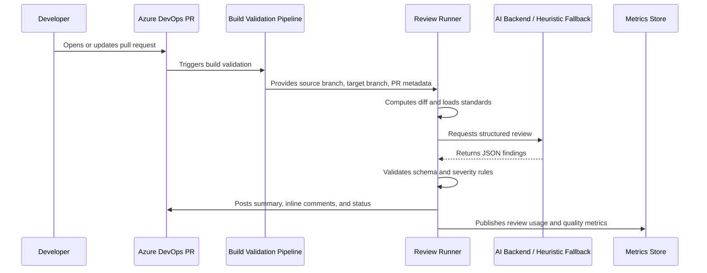

## The problem

Pull request reviews were inconsistent. Reviewer load was uneven, security and standards drift slipped through to merge, and there was no signal that the team's review bar was actually being applied uniformly across the estate. AI review was the obvious lever — but every prior attempt had stalled on the same three problems: unstructured model output that couldn't be enforced, no path from "running in advisory" to "blocking the merge," and no story for cost or kill-switching when something went wrong.

## The approach

Treat AI review as a **build-pipeline citizen**, not a magic chat client. Run it during PR validation. Make the model produce **schema-validated JSON** rather than prose. Classify findings by severity and let branch policy decide whether each severity blocks. Ship it in advisory mode first, instrument it heavily, and only then flip on enforcement repository by repository.

The single design choice that mattered most was the schema. Once the model is forced to emit a structured object with severity, file path, line range, and rationale, every other governance feature — gating, dedup, telemetry, kill-switch — becomes a small layer on top of normal pipeline plumbing.

## How it works

## What I built

- **Diff extractor and prompt assembler.** Pulls the unified diff from the PR, attaches the team's review standards, and constructs a deterministic prompt with explicit severity rubrics.
- **Schema-validated reviewer.** JSON Schema validation on every model response. Findings that don't match the schema are silently dropped rather than posted — model hallucinations never leak to the PR.
- **Heuristic fallback.** When credentials or quotas are unavailable, a deterministic linter-shaped fallback runs in place of the model so the pipeline behaves predictably.
- **Severity-aware posting.** Summary comment with overall risk, plus inline file comments for actionable findings. Critical and high findings can be wired to fail the build via branch policy; advisory findings always post but don't block.
- **Cost and usage telemetry.** Every run writes a metrics artifact: token counts, model used, finding distribution, repo and PR identifiers (sanitised). These roll up into a central store for management reporting.
- **Kill-switch and per-repo opt-in.** A central config can disable the reviewer org-wide in one commit, or scope it to a specific list of repositories.

## Impact at full scope

Hundreds of production-relevant repositories carry the reviewer through build validation. Thousands of AI-backed reviews run per month. Per-review API spend is in the low cents; the full-scope monthly cost lives comfortably inside an annual budget headroom of around two thousand dollars, while the recovered review time runs into thousands of developer-hours per year.

The dev-hours savings count only mechanical pre-triage. They don't count rework avoided when the AI catches secrets, missing tests, or risky changes before a human reviewer cycles, and they don't count the standards drift that doesn't happen because every review now sees the same rubric.

## The rollout pattern

1. Pilot on a small, friendly cohort.
2. Run advisory-only. Collect metrics. Tune prompts and severity rubric.
3. Expand repository coverage in waves.
4. Enable severity-based branch-policy gating, repo by repo.
5. Track adoption, cost, and finding distribution centrally for sign-off.

The same pattern transfers cleanly to any AI feature you want to ship inside an engineering org with real governance.
