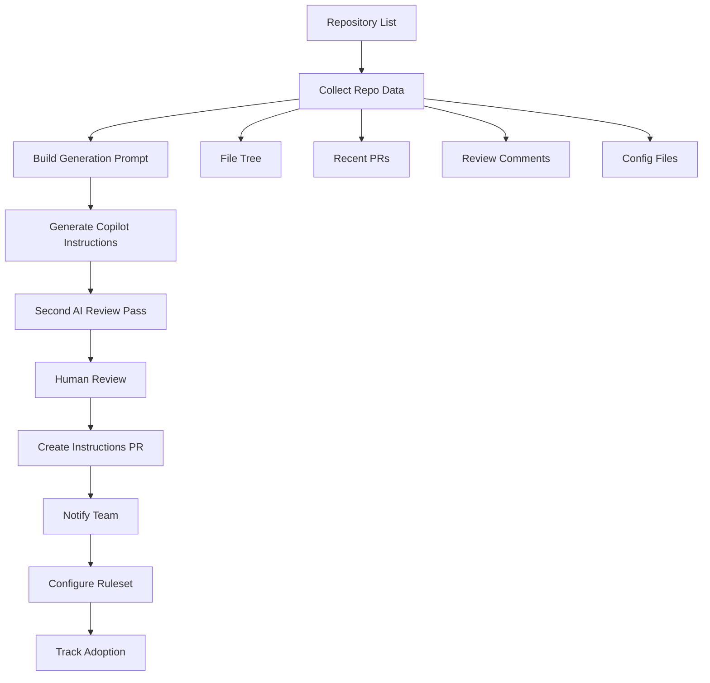

## The problem

GitHub Copilot can review PRs, but the quality is generic unless each repository ships its own `copilot-instructions.md`. Writing those by hand for every repo is a nonstarter at enterprise scale: hundreds of repositories, inconsistent conventions, no central owner for review standards.

## The approach

Treat the rollout itself as a product. Audit each repo, generate a tailored instructions file from real signal (recent PRs, review comments, file tree, config files), put it through a second AI critique pass for quality, then open a PR for human approval. After merge, configure the Copilot ruleset and notify the team. Track which repositories are onboarded, which are pending, and which are skipped - and report it.

## How it works

## What I built

- **Repo audit collector.** Pulls file tree, recent PRs, review comments, and config files (CI, linters, formatters) so the instruction prompt is grounded in real signal.
- **Generator + critique loop.** First AI pass drafts the instructions, second pass critiques them against the repo's conventions. Output is markdown that the team owns.
- **Batch PR creator.** Branches off, commits the instructions, opens a PR with a standard template and reviewer assignment. Runs in single-repo or batch mode.
- **Notification templates.** Pre-written team messages so rollout communication is consistent across hundreds of teams.
- **Ruleset configuration.** Pre-creates rulesets in disabled mode, ready to flip on after instructions land. Admin scope is isolated to this step.
- **Adoption tracker.** Generates a status report: which repos are merged, which are in flight, which are skipped. Feeds the management reporting layer.

## Impact

Manual setup ran 30–75 minutes per repository - repository inspection, instruction drafting, branching, PR creation, ruleset configuration, team notification. Across hundreds of repositories that's a multi-hundred-hour rollout. The tooling collapses the per-repo cost to minutes of human review time, and the adoption tracker means leadership knows what's onboarded without anyone having to assemble that picture by hand.

## What I'd do next

Surface the adoption tracker as a small dashboard so platform and engineering leadership share the same source of truth. Connect it to the same metrics store as the Azure DevOps reviewer so cost and quality signal lives in one place across both review platforms.
