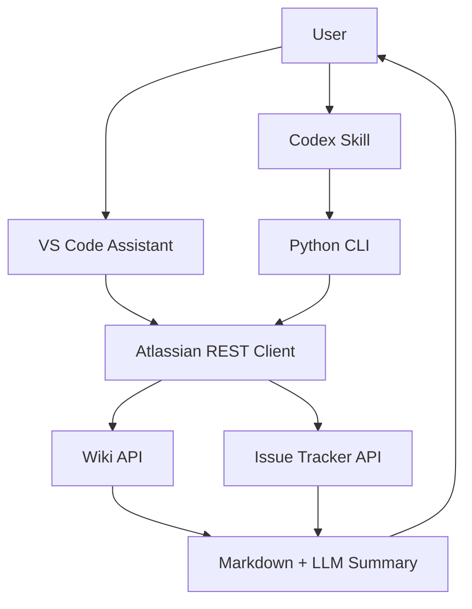

## The problem

The team needed AI-assisted access to wiki and issue-tracker content from inside the IDE. The natural path — MCP integration — was blocked by policy on shared service credentials and centrally hosted servers. Engineers and managers still had to look up wiki pages, search tickets, and summarise activity many times a day.

## The approach

Take the MCP path off the table. Use the Atlassian REST APIs directly. Issue **per-user tokens** instead of shared service credentials. Stay **read-only**. Ship the same capability through two surfaces: a VS Code chat participant for interactive use and a Codex skill with CLI scripts for terminal users. Keep credentials in VS Code SecretStorage or environment variables — never in a config file.

## How it works

## What I built

- **Wiki search and retrieval.** Keyword search, page fetch, Markdown conversion. Long pages get summarised before being shown.
- **Issue queries.** Generated and raw query language — engineers describe what they want, the assistant proposes the query, runs it, and summarises results.
- **Activity questions.** "What did this user touch in the last week" across wiki and issue tracker.
- **One-click installers.** Windows and macOS installers that handle token entry, secret storage, and VS Code extension registration in a single flow.
- **No server.** The assistant is entirely client-side. There's no shared backend to compromise, no service credential to rotate, and no platform exception to chase.

## Outcome

A policy-compatible way to bring enterprise knowledge into the AI workflow that engineers were already using. The assistant ships the value the MCP route was meant to ship — without the security and infrastructure dependencies that blocked it. Wiki and ticket lookups that previously took 5–15 minutes through portal search become natural-language queries with summarised answers.

## Why per-user tokens matter

Per-user tokens are the unlock. They preserve the audit trail (every query is attributable), respect existing access controls (the assistant can only see what the user can see), and avoid the shared-credential failure modes that block most enterprise AI integrations. It's not the most exciting design choice in this portfolio, but it's the one that made everything else possible.
