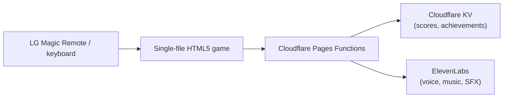

## What it is

A Triviaverse-inspired, two-player trivia game show for LG webOS TVs (and any browser): neon game-show visuals sized for viewing distance, full Magic Remote and keyboard navigation, speed scoring with a streak multiplier, and South African Afrikaans expressions ("Lekker!", "Ja Boet!", "Haibo!") woven through the feedback.

## How it works

## What I optimised for

- **Zero install friction on a TV.** The entire game is a single HTML file with zero dependencies - point the TV's built-in browser at a URL and it runs, no app store, no sideloading.
- **AI-generated audio that degrades gracefully.** ElevenLabs generates custom music and sound effects, cached in KV - if the API is unavailable, a Web Audio API synth step-sequencer fills in seamlessly, so the game never goes silent.
- **A real two-player format.** Streak multipliers, speed scoring, and an answer-cascade reveal are built around a head-to-head living-room dynamic, not a leaderboard of strangers.

## Status

Personal project, built for home use on an LG webOS TV. 250+ built-in questions across custom categories (Frenchies, Braai Culture, SA Food & Slang, and more), 15 unlockable achievements per player, and a PIN-locked admin panel with an ElevenLabs cost dashboard.
