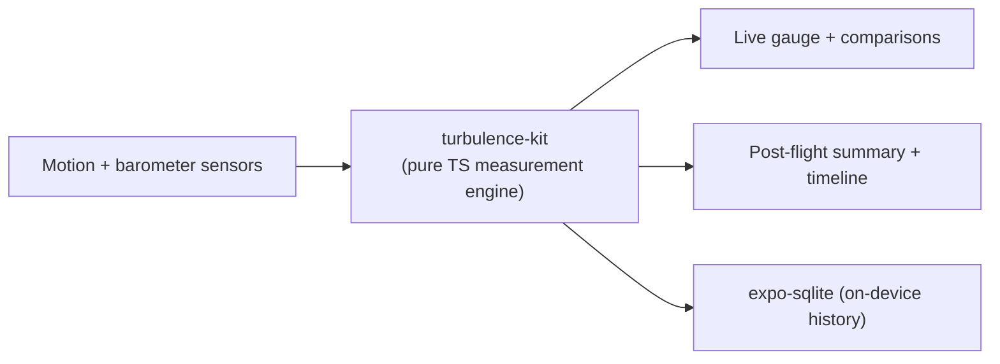

## What it is

A companion app for anxious flyers: a live turbulence gauge built from the phone's own motion and barometer sensors, classified smooth/light/moderate/strong and translated into everyday comparisons instead of raw numbers. Guided breathing and grounding exercises, a post-flight summary, and a self-recorded offline flight-path chart round it out - all without a network connection, by design.

## How it works

## What I optimised for

- **Offline as the default, not the fallback.** No map tiles, no network calls except two narrow, disclosed exceptions (an opportunistic reverse-geocode, an optional user-entered flight-tracking link) - everything else runs on-device.
- **A measurement engine with no UI dependencies.** `turbulence-kit` is pure TypeScript with zero React/Expo imports - band-pass filtering, rolling RMS, bump detection, and flight-phase state all unit-tested independent of the app shell.
- **Reassurance through honesty, not vibes.** Every comparison is a real physical analogy grounded in the actual g-force reading, not a generic calming platitude.

## Status

In active development, iOS only, built with Expo/React Native from a Windows machine (no local Xcode). Core measurement engine and TestFlight builds are in place; see the project's own changelog for the current build.
