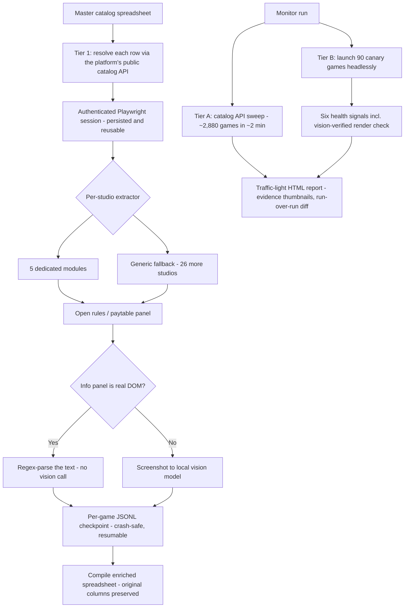

## The problem

An online slots lobby at a major casino operator lists roughly 3,400 games from around 60 game studios. Two jobs around that catalog were entirely manual:

- **Metadata transcription.** Enriching the games catalog for player recommendation models meant a person opening each game, dismissing splash screens, finding the rules and paytable panel, and reading off ~10 fields - volatility, RTP, max-win multiplier, bonus-buy and free-spins availability, mechanic flags, bet limits. At four to six minutes per game, a full refresh is an estimated five to seven person-weeks of transcription.
- **Uptime verification.** Confirming games were actually live meant people logging in and launching them by hand, every hour.

## How it works

## What I built

- **A tiered extraction pipeline.** Catalog resolution against the platform's public API first, then an authenticated browser session, then per-studio extractor modules behind one shared interface - five dedicated modules, with everything else routed through a defensive generic fallback (conditional splash dismissal, vision-guided icon location with retries, cross-frame DOM scans). Covers 31 slot studios.
- **DOM-first, vision-second.** When the rules panel is real DOM, a regex parser reads it for free; only image-rendered panels go to the vision model. The model is Qwen3-VL served locally - a full catalog run makes on the order of 40,000 vision calls, an estimated four-figure API bill per run at paid-inference prices, and zero locally.
- **Crash-safe by construction.** Every game writes a JSONL checkpoint, so any run resumes exactly where it died, and the final spreadsheet compiles from checkpoints while preserving every original column.
- **A two-tier uptime monitor.** A fast API sweep verifies ~2,880 games still exist in about two minutes; a deep tier launches sample games in a headless browser and only calls one "ready" when six independent signals pass - including a screenshot showing a live symbol grid and working balance and bet controls. Output is a self-contained traffic-light HTML report with embedded evidence thumbnails and diffs against the previous run, exiting non-zero on any red studio so a scheduler can alert.

## Impact

- **Metadata refresh:** an estimated five to seven person-weeks of manual transcription per pass, replaced by two to three days of unattended runtime.
- **Extraction quality:** first full-catalog studio runs came back 99% clean on one studio, and iterative hardening lifted another from 33% to 82% coverage.
- **Uptime checks:** ~2,880 games verified in ~2 minutes (fast tier), or ~29 minutes with vision-confirmed render checks - no humans in the loop.
- **Inference cost:** zero per run, by serving the vision model locally instead of calling a paid API (an estimated four-figure saving per full catalog pass).

## Status

A working proof of concept, run on demand. All identifiers, platform details, and studio names are sanitised here. Next steps are scheduled execution and an automated test harness.
