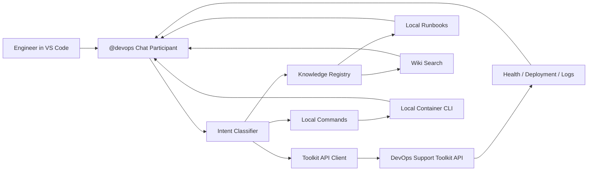

## The problem

Incident response had a context-switch tax. Wiki for runbooks, monitoring portal for health, deployment dashboard for sync status, container CLI for pod and log details, search platform for index questions. Every switch slows the response and risks the engineer losing the thread of what they were investigating.

## The approach

Bring the workflows to the engineer instead. A VS Code chat participant exposing the support toolkit's API as natural-language commands inside Copilot Chat. Live operational actions go through a two-step prepare/confirm flow so the chat stays safe: the assistant always shows the planned change before executing it.

## How it works

## What I built

- **Intent classifier.** Routes natural-language questions to the right backend - knowledge search, toolkit API, or local container CLI.
- **Knowledge layer.** Runbook and known-issue retrieval first; wiki search as fallback. Results are summarised, not pasted.
- **Live operational shortcuts.** Deployment health, sync status, recent history; pod, log, and event lookups; incident packs that stitch a coherent picture together from multiple sources.
- **Two-step prepare/confirm.** Every live action shows the planned change first. Engineers explicitly confirm before anything is executed. No one-shot destructive actions in chat.
- **Follow-up suggestions.** After a meaningful health check, the assistant proposes the natural next command - same pattern as the toolkit CLI.
- **Inline Copilot review hooks.** Commands to generate, refine, or critique Copilot review instructions for the current repo.

## Outcome

For roughly ten meaningful uses per engineer per day, the chat participant saves 10–20 minutes per lookup or incident step - runbook search, log collection, deployment history. Across the team that adds up to hundreds of hours per year, but the bigger win is qualitative: the IDE becomes a place where operational signal lives, not just code.

## What it doesn't do

The chat participant deliberately doesn't run unsafe destructive actions, doesn't paste raw secrets, and doesn't substitute for runbooks - it points to them. Keeping that line clear is part of why the team trusts it inside the live workflow.
