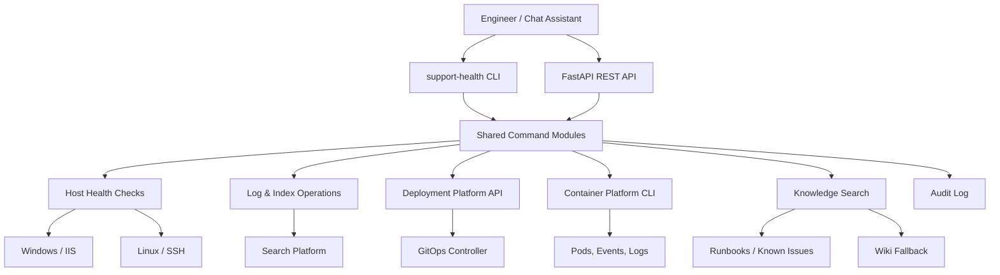

## The problem

A typical support pass meant moving through monitoring portals, server SSH sessions, deployment dashboards, search platforms, runbook wikis, and container CLIs - once for each question. The process was slow, inconsistent, dependent on engineer experience, and brittle when the senior engineer was off. There was also no audit trail for the maintenance actions that did get taken.

## The approach

Standardise the operational vocabulary. Build a CLI that wraps the common workflows (health, logs, deployment status, runbook search, safe cleanup) behind named commands with structured output. Add a REST API so chat assistants and future integrations can hit the same workflows. Default destructive actions to dry-run and require explicit confirmation flags for live execution. Audit-log everything sensitive.

## How it works

## What I built

- **Shared command modules.** Health checks, log/index operations, deployment status, container diagnostics, and knowledge search - each with structured output the CLI and API both consume.
- **Interactive menu mode.** For engineers who'd rather pick than type, the CLI offers a discoverable menu, then prints the equivalent command for next time.
- **Triage suggestions.** After a health check, the toolkit suggests follow-up commands based on detected symptoms - turning a single check into a guided incident path.
- **Safe-by-default cleanups.** Dry-run is the default for every destructive command. Live execution requires an explicit flag and writes to the audit log.
- **REST API parity.** Every CLI workflow has a matching API endpoint, so chat assistants and tooling can call the same backend without re-implementing logic.

## Outcome

A multi-system support pass that previously took 2–4 hours of portal-hopping now takes 15–30 minutes through guided commands and triage output. Across an active support shift, that's hours saved per engineer per day, with the additional benefit that newer engineers get a guided path through workflows that previously needed senior context.

## Patterns worth lifting

Two patterns are reusable beyond this team: **structured-output CLIs** (every command emits JSON when asked, which makes them composable) and **prepare-then-confirm** for live operational actions (the same pattern shows up in the chat participant and the Kafka deployment assistant).
