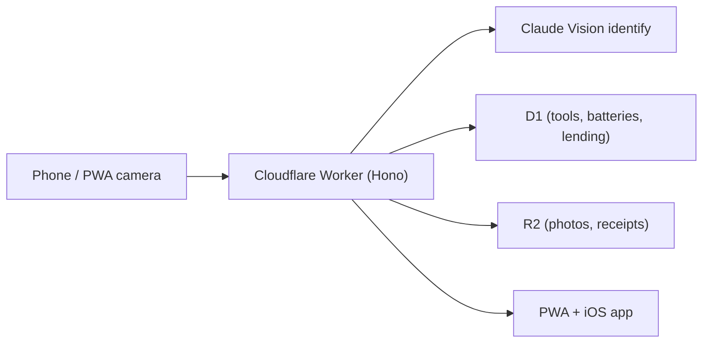

## What it is

A private, cross-brand smart catalog for the modern toolbox. Photograph a tool and Fettle identifies it, catalogues it, remembers where it's stored, and tells you which batteries fit which tools across the major cordless platforms - so a Milwaukee pack doesn't get bought for a DeWalt drill by mistake.

## How it works

## What I optimised for

- **One backend, two frontends.** The PWA and the native iOS app share the same Worker API - auth, tools CRUD, photos, identify, lending, and IAP entitlements all live in one place.
- **The battery matrix.** Cross-brand cordless tools are the actual pain point owners have - a "Missing a charger?" card with wall-voltage cautions for cross-region purchases is the feature that makes the catalog worth keeping open.
- **Monetization that doesn't get in the way.** A Pro subscription (verified server-side) sits alongside Amazon Associates affiliate routing for restock suggestions - neither blocks the core cataloguing loop.

## Status

Beta. Backend and PWA are live at [fettle.tools](https://fettle.tools) with open public registration; a native iOS app (Expo/React Native) is in TestFlight on the same backend, with full feature parity plus native camera capture and Fettle Pro.
