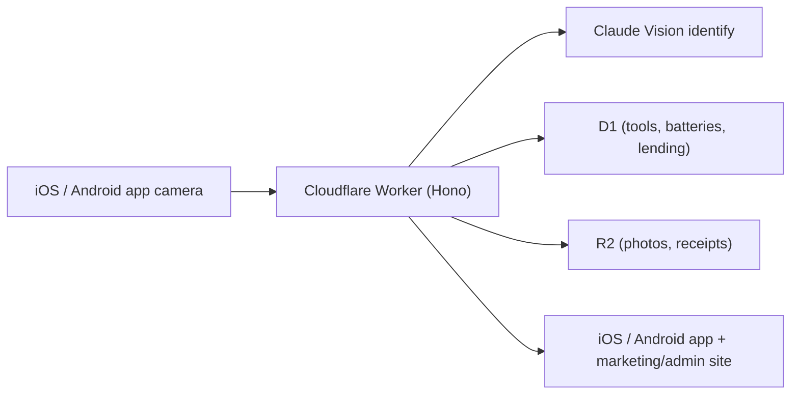

## What it is

A private, cross-brand smart catalog for the modern toolbox. Photograph a tool and Fettle identifies it, catalogues it, remembers where it's stored, and tells you which batteries fit which tools across the major cordless platforms - so a Milwaukee pack doesn't get bought for a DeWalt drill by mistake.

## How it works

```mermaid
flowchart LR
    Camera["iOS / Android app camera"] --> Worker["Cloudflare Worker (Hono)"]
    Worker --> Vision["Claude Vision identify"]
    Worker --> D1["D1 (tools, batteries, lending)"]
    Worker --> R2["R2 (photos, receipts)"]
    Worker --> Client["iOS / Android app + marketing/admin site"]
```

## What I optimised for

- **One backend, native mobile clients.** The iOS and Android apps and the marketing/admin surface at fettle.tools share the same Worker API - auth, tools CRUD, photos, identify, lending, and IAP entitlements all live in one place.
- **The battery matrix.** Cross-brand cordless tools are the actual pain point owners have - a "Missing a charger?" card with wall-voltage cautions for cross-region purchases is the feature that makes the catalog worth keeping open.
- **Monetization that doesn't get in the way.** A Pro subscription (verified server-side) sits alongside Amazon Associates affiliate routing for restock suggestions - neither blocks the core cataloguing loop.

## Status

Live on iOS and Android, with native camera capture and Fettle Pro. Available on the [App Store](https://apps.apple.com/za/app/fettle-tool-inventory/id6788440954) and [Google Play](https://play.google.com/store/apps/details?id=tools.fettle.app). The backend, marketing site and admin surface run at [fettle.tools](https://fettle.tools), sharing the same Worker API with the mobile apps.
