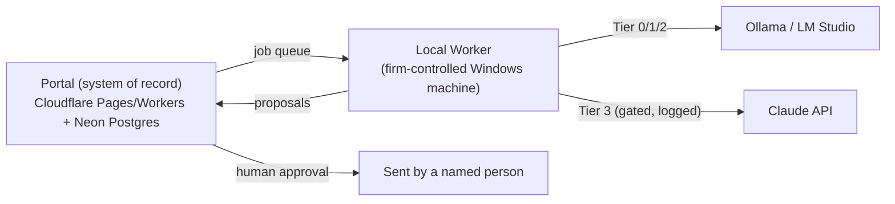

## What it is

An operational platform for small-to-mid South African accounting firms, covering the work around tax submission rather than the submission itself: collecting and classifying client documents, extracting the numbers, chasing what's missing, assembling review-ready packs, and triaging SARS correspondence into tracked cases with approval-gated response drafts.

## How it works

## What I optimised for

- **Local-first by default.** Document classification, extraction, and drafting run on a machine the firm controls; cloud AI is a logged, policy-gated exception, not the default path.
- **A human in the loop, enforced in the schema.** Every AI output lands as a proposal in an approvals queue - the database's own constraints, not just app logic, make an unapproved send impossible.
- **Boundaries that are binding, not disclaimers.** FiscalAI never touches eFiling, stores SARS credentials, or sends client communication without a named human's sign-off - designed in, not bolted on.

## Status

Private pilot, pre-launch. Piloting with a small South African chartered accounting firm through the 2026 filing season on a feature-complete portal running synthetic data; live model calls and a real connected mailbox are gated behind a documented readiness checklist ahead of real client data.
