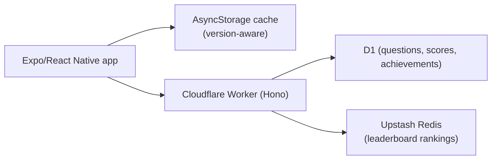

## What it is

A mobile trivia game for French Bulldog owners and enthusiasts: 1,100 questions across 14 categories (Breed History, Genetics & Colours, Famous Frenchies, and more), with Quick Play, Ranked Play, a Daily Challenge, and a Speed Round, plus achievements and global/country leaderboards. Free to play with an optional annual Premium subscription.

## How it works

## What I optimised for

- **Offline as a designed fallback, not an afterthought.** All 1,100 questions ship embedded in the binary; a version-aware AsyncStorage cache sits in front of the API, and Quick Play and Ranked Play both work with zero signal - scores queue silently and sync when connectivity returns.
- **Real account infrastructure from the start.** Firebase Auth (guest, email, Apple, Google) with full GDPR-compliant account deletion, not a bolt-on added after launch.
- **Five languages, not just English.** UI strings, feedback, achievements, and the full question bank are translated into Spanish, French, Portuguese, and German - a deliberately larger scope than a solo trivia app usually takes on.

## Status

In active development. Backend live on Cloudflare Workers; the marketing site is live at [frenchietrivia.com](https://frenchietrivia.com) with a playable demo. Android is in Google Play closed testing; iOS TestFlight and App Store submission are next.
