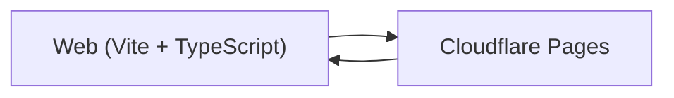

## What it is

A trivia game with a French Bulldog mascot. Yes, really. It's silly, but it's a real Vite app, on a real CDN, with real users (who are mostly relatives).

## How it works

## Why it's here

The portfolio isn't only enterprise work. Personal-scale projects keep the frontend muscle warm — type discipline, build tooling, accessibility, deploy automation — and they're a useful counterweight to platform engineering, which tends not to ship visual things.

## Status

Live on the open web.
