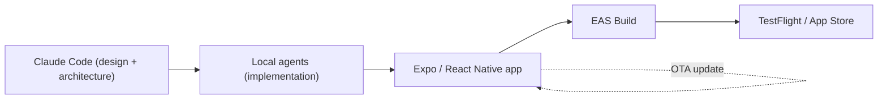

## What it is

A proudly South African one-tap arcade game: fly a hadeda ibis through the wires, jacarandas and Highveld storms of a Mzansi dawn. A flap-through-gaps game with a six-city tour of the country, a real SA hadeda screech, storm and taxi-gauntlet events, and a shareable branded high-score card.

## How it works

## What's interesting about it

- **No Mac, shipped to iPhone anyway.** The entire pipeline - design, build, and TestFlight/App Store submission - runs through Expo EAS Build from a Windows machine.
- **Resilient audio as a design constraint.** The screech always fires and the soundtrack survives interruptions (notifications, Siri, screen recording) via a watchdog - the kind of production hardening a demo build skips but a shipped game can't.
- **AI-planned, agent-built.** Claude Code does the design and architecture; local agents implement phase by phase; local image models generate the art. The repo's structure documents that split explicitly.

## Status

Live and approved on the [App Store](https://apps.apple.com/app/hadeda-havoc/id6777222298), paid (no ads, no IAP, no accounts). The marketing homepage at [hadeda-havoc.stewartb.workers.dev](https://hadeda-havoc.stewartb.workers.dev) was rebuilt the same day the app went live - hero, features, a six-city gallery, and a real interactive "hear the screech" moment.
