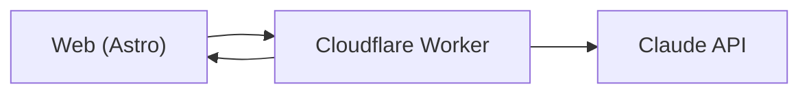

## What it is

A small web tool for translating, defining, and exploring South African languages. It's a personal project - not a product line - but it's live and used by friends and family.

## How it works

## What I learned building it

- **Honest model limits.** Claude is excellent at IsiZulu and competent at IsiXhosa; less reliable on smaller languages. The UI surfaces that confidence rather than hiding it.
- **Astro for content-shaped tools.** When the product is mostly content with a thin interactive layer, Astro is the right reach.
- **Cloudflare Pages for solo projects.** Free, fast, and the operational story is "git push." Hard to beat.

## Status

Live on the open web. Iterating slowly as the underlying model improves.
