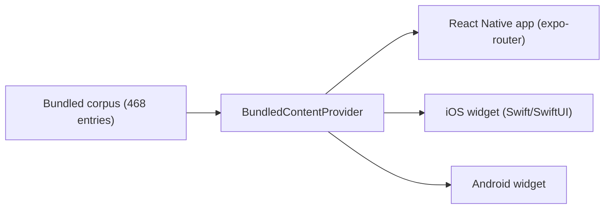

## What it is

A widget-first word discovery app: a different South African word or phrase lands on your home screen every morning, drawn from a 468-entry curated corpus spanning isiZulu, isiXhosa, Afrikaans, Sesotho, Sepedi, Setswana, Tshivenda, Xitsonga, siSwati, isiNdebele, Tsotsitaal, Kaaps, and SA Indian English.

## How it works

## What I optimised for

- **The widget is the product.** The app exists to feed the home-screen widget a new word a day - everything else (browsing, audio pronunciation, favourites) is secondary to that daily surface.
- **A swappable content layer.** `BundledContentProvider` ships the corpus in the app bundle for V1, with the abstraction already in place to swap in a `RemoteContentProvider` later without touching the UI.
- **No accounts, no tracking.** No behavioural tracking, no advertising or analytics SDKs - content ships in the bundle, and the only data leaving the device is an App Store/Play Store receipt if someone buys Pro.

## Status

Live on the App Store and Google Play (1.0.2, worldwide) since 2026-06-12, with native widgets on both platforms and audio pronunciation for Afrikaans, isiZulu, and SA Indian English so far.
