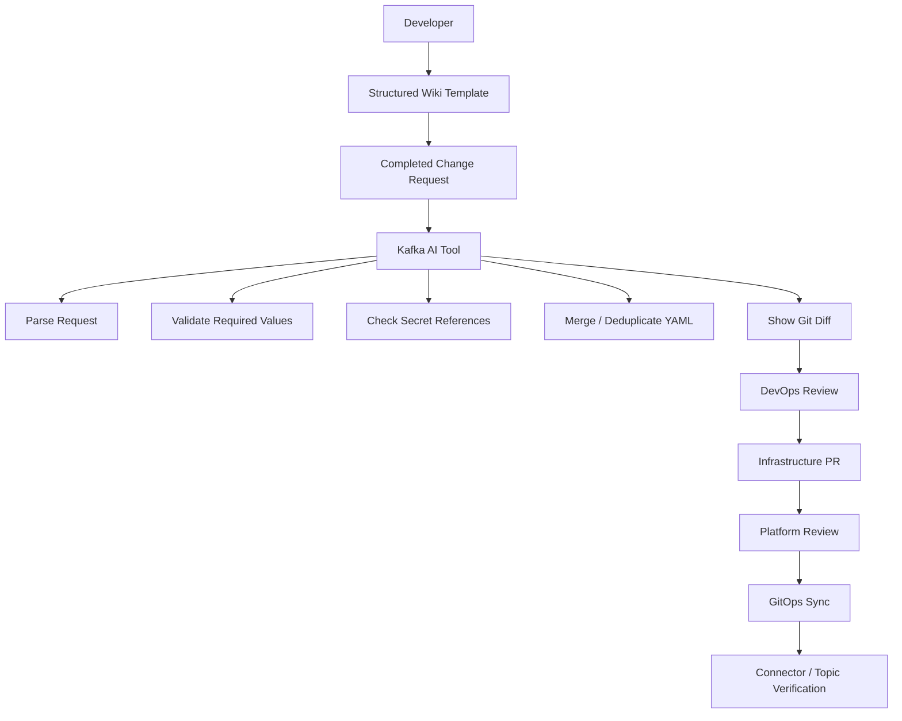

## The problem

Kafka topic and connector deployments required engineers to translate developer requests into infrastructure YAML by hand. The process was vulnerable to formatting mistakes, duplicate topics, inconsistent environment values, and missing secret references. Every step was manual, and validation only happened during the PR review — by which point a malformed request had already become a malformed YAML file.

## The approach

Move the validation **upstream of the YAML**. Give developers a structured wiki template that captures what they actually need (topic name, environment, secret references, replication, retention). Build a tool that parses the template, validates required fields, checks Vault references, normalises values, deduplicates against existing definitions, and generates the YAML diff for review. The PR is what GitOps deploys; the tool is what makes the PR safe.

## How it works

## What I built

- **Developer-facing request templates.** Structured wiki templates that make the necessary inputs explicit and the optional inputs visible.
- **Parser and validator.** Reads the template, validates required fields against the target environment, and surfaces missing or malformed inputs *before* generation.
- **Vault reference checker.** Confirms secret references resolve in the target environment without ever fetching the secret itself.
- **Duplicate detection with normalisation.** Catches topic redefinitions even when the YAML uses different formatting or value casing.
- **Diff preview.** Shows the engineer the exact infrastructure change before a PR is opened, so review is reading a diff, not reverse-engineering a request.
- **Manual AI fallback.** When the API path is unavailable, the tool prints a curated prompt the engineer can paste into a chat client — same workflow, different transport.

## Outcome

A typical Kafka request that previously required 30–90 minutes of manual interpretation, validation, YAML drafting, and secret checking is now a structured intake that produces a reviewable diff in minutes. The defects that used to surface in production — duplicate topics, missing secret refs, wrong environment values — are caught at intake time. GitOps still owns deployment; this tool just makes sure GitOps gets a clean PR.
