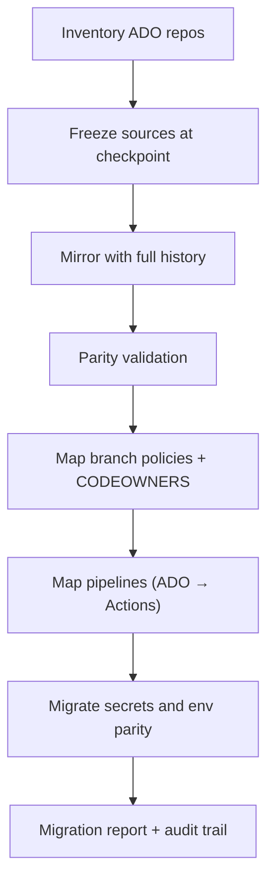

## The problem

Azure DevOps to GitHub migration tooling at the open-source layer tends to handle the cheerful path: clone the repo, push to the new remote, declare success. The hard parts of an enterprise migration aren't on the cheerful path - they're freezing the source so it can't be written to mid-migration, retrying half-failed batches without re-cloning everything, mapping branch policies across two different policy models, and proving to an auditor at the end that what's in GitHub is what was in Azure DevOps.

## The approach

Treat the migration as a pipeline, not a script. Inventory first. Freeze sources at a known checkpoint. Mirror with full history. Validate parity. Map branch protections and CODEOWNERS. Map pipelines (or document the mapping where Actions doesn't have a 1:1). Generate a migration report. Make every step idempotent and re-runnable.

## How it works

## What it does well

- **Inventory via REST.** A PowerShell + Python inventory pass that catalogues every ADO repo with metadata: size, branches, recent commits, policies in force, contributors.
- **Source freeze.** A documented, reversible freeze procedure for the source repository so writes can't happen during migration.
- **Mirror with history and tags.** Full history mirror; tags preserved; LFS handled.
- **Branch protection & CODEOWNERS mapping.** Best-effort mapping from ADO's policy model to GitHub's, with explicit warnings where the mapping isn't 1:1.
- **Pipeline mapping.** ADO YAML pipelines mapped to GitHub Actions where possible; documented where not.
- **Validation checklist.** Auditable parity proof at the end - commit hashes, branch list, policy summary, contributor mapping.
- **Rollback plan.** Documented and tested. The freeze step is reversible until the new repo goes live.

## Why this is in public

Two reasons. First, this is the kind of tool that should exist as open source - the work isn't proprietary, the value is in the rigor, and the next team facing this migration shouldn't have to re-derive the freeze step from scratch. Second, having the platform in public is a portable demonstration of how I think about enterprise-scale, high-stakes automation: idempotent, auditable, reversible, and documented for the next operator.

## What it deliberately doesn't do

It doesn't pretend ADO and GitHub are the same product. Where the policy model or pipeline model doesn't translate cleanly, the tool flags it and asks for a decision rather than guessing. Migrations fail when tooling silently mistranslates intent; this one is loud on purpose.
