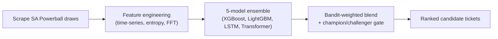

## What it is

A self-improving statistical platform for South African Powerball: scrapes the full draw history back to 2009, engineers time-series/entropy/frequency-domain features, and runs a five-model ensemble (XGBoost, LightGBM, LSTM, Transformer, and a stacking meta-learner) that retrains automatically as new draws land. A local Ollama model turns each run's metrics into a plain-language summary.

## How it works

## What I optimised for

- **An honest scoreboard, not a marketing number.** A dedicated tier-hit calibration backtest measures the system against random ticket selection over 500 real draws - the current, published result is a 1.59x payout lift, with the "no jackpots predicted" caveat stated as plainly as the win.
- **Champion/challenger discipline.** Every backtest and pipeline run feeds a promotion gate with configurable thresholds - a new model only replaces the incumbent when it demonstrably beats it, tracked in the database, not just in a notebook.
- **Drift and monitoring as first-class citizens.** Weekly GitHub Actions jobs run backtests and drift detection (PSI, KL divergence, KS statistic) and open an issue automatically if a model's performance degrades.

## Status

Personal project, run locally with a Next.js dashboard and a Python ML microservice. 1,700+ historical draws ingested, five model types trained and benchmarked, automated weekly backtest and drift-detection jobs in CI. Educational and entertainment use only - see the project's own disclaimer.
