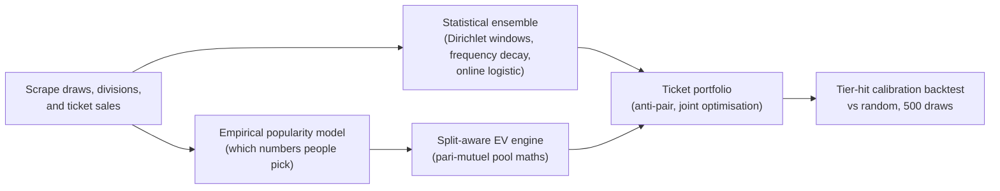

## What it is

A statistical platform for South African Powerball: scrapes the full draw history (1,740 draws, including the 2026 operator change that shrank the PowerBall pool from 1-20 to 1-16), the nine-division prize breakdowns, and ticket sales. It originally trained a five-model ML ensemble (XGBoost, LightGBM, LSTM, Transformer, stacking) - until a leak-free re-evaluation showed the honest hit rate was 20.4%, statistically indistinguishable from random, and the previously reported ~94% was a data-leakage artifact. The models were retired from the live pipeline, and the system was rebuilt around conditional payout instead of number prediction. A local Ollama model still narrates each run in plain language.

## How it works

## What I optimised for

- **An honest scoreboard, even when it flips the story.** The dedicated calibration backtest measures the system against random ticket selection over 500 real draws. When it exposed the ML ensemble's edge as leakage, that result was published and the models were pulled - the current claim is a 2.41x payout lift (R1.30 vs R0.54 expected value per ticket), and it is explicitly a payout edge, never a hit-probability edge.
- **The edge that's actually real.** South African Division 1/2 prizes are pari-mutuel - the pool splits among winners - so unpopular number combinations retain more of the pot. The split-aware EV engine quantifies that: a +2.2% payout uplift at a R20M jackpot rising to +8.5% at R200M, driven by an empirical model of which numbers people actually pick.
- **Adapting to the real world.** When the operator changed in mid-2026 (new ball pool, renamed games, dead data sources), the scrapers, models, and EV maths were rebuilt against the new rules rather than left quietly stale.

## Status

Personal project, run locally: a Next.js dashboard (statistics, analysis, predictions, monitoring) over a Python FastAPI ML service. 1,740 historical draws ingested; the live ensemble is five statistical models (three Dirichlet windows, frequency decay, online logistic) with the retired ML trainers kept for archival comparison. Educational and entertainment use only - see the project's own disclaimer.
