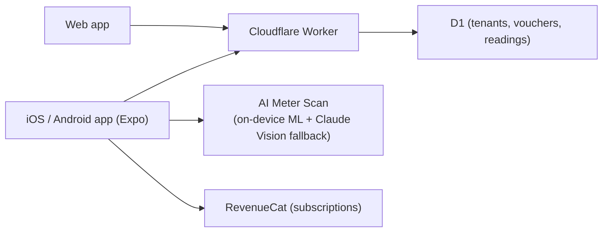

## What it is

A multi-tenant SaaS app that tracks prepaid electricity tokens, computes cost per kWh net of VAT, and projects monthly spend for South African households on prepaid meters. What started as a single-user web tool is now a full product: family-account tenancy, SMS voucher parsing for every major SA bank, and a native iOS/Android app alongside the web dashboard.

## How it works

## What I optimised for

- **One backend, two frontends, real tenancy.** Web and mobile share the same Cloudflare Worker API, with complete data isolation between family accounts rather than a single-user assumption bolted on later.
- **AI meter scan that works offline-first.** A custom on-device model reads South African 7-segment prepaid meter displays in ~100ms; Claude Vision is the cloud fallback only when the on-device read isn't confident.
- **VAT-aware costs, still.** Every figure is shown net and gross of 15% VAT - the only honest way to compare months when token prices shift, unchanged from the original web tool's design point.

## Status

Live on the web at [powermeter.app](https://powermeter.app/login) and as a native app for iOS and Android (React Native/Expo, Firebase auth, RevenueCat subscriptions). A single Pro tier (R149.99/year) unlocks AI meter scan, PDF report export, and an iOS home-screen widget.
