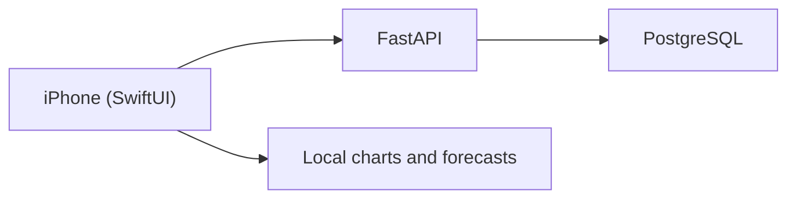

## What it is

A small consumer app that tracks prepaid electricity tokens, computes cost per kWh net of VAT, and projects monthly spend. The audience is SA households on prepaid meters who want to know whether the next R500 token will see them through the month.

## How it works

## What I optimised for

- **One-screen mental model.** The home screen shows the current month's spend, units, and forecast. Everything else is one tap away.
- **VAT-aware costs.** Every cost figure is shown net and gross of 15% VAT — the only honest way to compare months when token prices shift.
- **Forecasts that admit uncertainty.** A range, not a point. The app says "between X and Y given current usage," not "you'll spend exactly Z."

## Status

Live on the App Store. iPhone-only by design — the audience uses iOS in the South African prepaid demographic the app targets, and supporting Android wasn't worth the duplication on a personal-tool budget.
