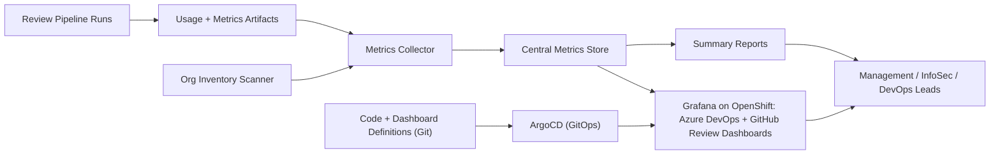

## The problem

The AI PR review systems generated useful per-run data: token counts, finding distribution, costs, repository identifiers. But that data lived in pipeline artifacts, scattered across hundreds of repositories. There was no consolidated picture of which repos were onboarded, what the rollout was costing, where adoption was trending, and what risks the rollout was actually catching. Without that picture, sign-off on continued investment was hard.

## The approach

Build a thin reporting layer on top of the pipelines. Every review run already wrote a metrics artifact; now those artifacts get collected centrally. Add an organisation inventory scanner so the rollout list is always derived from real repository state, not a stale spreadsheet. Generate weekly and on-demand summaries in a format leadership can actually read. The consolidated picture is served through Grafana dashboards on OpenShift, delivered via GitOps so the reporting surface can evolve as quickly as the questions leadership asks.

## How it works

## What I built

- **Per-run usage artifacts.** Token count, model used, finding distribution, repository and PR identifiers (sanitised), pipeline run ID. Standard schema across both Azure DevOps and GitHub Copilot review systems.
- **Central metrics collector.** Pulls artifacts from across the org into a single branch-backed store with a stable schema.
- **Org inventory scanner.** Scans the source-control estate and tags each repository with its rollout state - onboarded, advisory, enforced, opted-out, archived.
- **Rollout status exports.** Generated weekly. Adoption count, cost trend, finding distribution, top repositories by review volume.
- **Leadership summaries.** Pre-formatted briefs and presentation-ready material. Same source data, different audience.
- **Grafana dashboards on OpenShift, delivered via GitOps.** The metrics store is surfaced through two Grafana dashboards running on OpenShift: one covering AI PR reviews on Azure DevOps (review volume, comments, usage and cost) and one covering AI PR reviews on GitHub (review volume and comments). ArgoCD watches the repository, so any change to the collector code or dashboard definitions is detected and deployed automatically - when leadership requests a new metric or view, the change ships on commit and appears on the next dashboard refresh, with no manual deployment step.
- **Threshold monitoring on the rollout signals.** The dashboards track cost drift (reported in both USD and ZAR), adoption stalls, and unusual finding spikes, so deviations surface as they happen rather than at the next reporting cycle. Alert rules live in the repository and ship through the same ArgoCD pipeline as everything else.

## Outcome

The reporting cadence dropped from "manual one-day exercise per cycle" to "scripted in minutes." The conversation in leadership reviews shifted from "is the AI review actually being used?" to "do we want to expand the rollout to the next set of repositories?" - which is the conversation worth having. Because delivery is GitOps-driven, requested metrics and dashboard changes reach management without deployment ceremony: commit the change, ArgoCD syncs it, and a dashboard refresh shows the new view.

## What I'd do next

Correlate review findings with post-merge outcomes - defect rates, rework, incident links - to quantify what the AI reviews actually prevent. The adoption and cost picture is already live on the dashboards; tying findings to downstream outcomes would turn it into impact evidence: not just "the reviews are used and affordable" but "here is what they caught before it shipped."
