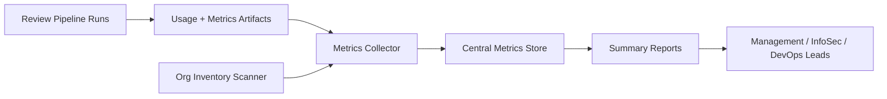

## The problem

The AI PR review systems generated useful per-run data: token counts, finding distribution, costs, repository identifiers. But that data lived in pipeline artifacts, scattered across hundreds of repositories. There was no consolidated picture of which repos were onboarded, what the rollout was costing, where adoption was trending, and what risks the rollout was actually catching. Without that picture, sign-off on continued investment was hard.

## The approach

Build a thin reporting layer on top of the pipelines. Every review run already wrote a metrics artifact; now those artifacts get collected centrally. Add an organisation inventory scanner so the rollout list is always derived from real repository state, not a stale spreadsheet. Generate weekly and on-demand summaries in a format leadership can actually read.

## How it works

## What I built

- **Per-run usage artifacts.** Token count, model used, finding distribution, repository and PR identifiers (sanitised), pipeline run ID. Standard schema across both Azure DevOps and GitHub Copilot review systems.
- **Central metrics collector.** Pulls artifacts from across the org into a single branch-backed store with a stable schema.
- **Org inventory scanner.** Scans the source-control estate and tags each repository with its rollout state — onboarded, advisory, enforced, opted-out, archived.
- **Rollout status exports.** Generated weekly. Adoption count, cost trend, finding distribution, top repositories by review volume.
- **Leadership summaries.** Pre-formatted briefs and presentation-ready material. Same source data, different audience.

## Outcome

The reporting cadence dropped from "manual one-day exercise per cycle" to "scripted in minutes." The conversation in leadership reviews shifted from "is the AI review actually being used?" to "do we want to expand the rollout to the next set of repositories?" — which is the conversation worth having.

## What I'd do next

Surface the same data through a small web dashboard so the metrics layer becomes self-service. The data is already there; it just needs a viewing surface. That work converts the reporting layer from a "send me the brief" interaction into a "I'll go look" one — which scales much better as adoption grows.
