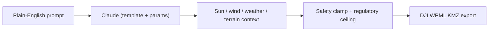

## What it is

A natural-language to DJI WPML mission generator: describe a shot ("slow orbit of the manor house at golden hour, 60m radius") and ShotKit maps it to one of 8 cinematic templates, generating a flight-ready KMZ that loads directly into DJI Fly or DJI Pilot 2. Terrain-follow paths, patrol/perimeter missions, and manual waypoint import round out the planning side.

## How it works

## What I optimised for

- **The prompt does the work a UI usually does.** Cardinal-direction hints, time-of-day phrases ("golden hour"), mood vocabulary ("Nolan/IMAX"), and negative constraints ("stay away from Y") all parse out of one text box instead of a dozen form fields.
- **Safety that can't be skipped by accident.** A post-Claude clamp silently corrects any proposed altitude/speed/radius beyond the drone or regulatory envelope, and export is gated behind a fresh airspace/NFZ check and pre-flight checklist - no KMZ downloads without it.
- **Real flight physics, not just geometry.** Battery planning accounts for wind, temperature, and transit distance; wind-aware speed fixes derate per-segment speeds for crosswind stability.

## Status

Live on the open web at [shotkit.stewartb.workers.dev](https://shotkit.stewartb.workers.dev), with an iPad companion app (Expo/React Native) for on-site planning. 8 mission templates, per-country regulatory ceilings across 8 regions, and export to KMZ/GeoJSON/GPX/CSV/PDF brief.
