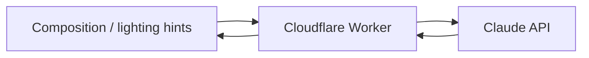

## What it is

A pocket assistant for amateur photographers. The phone reads the scene, sends the relevant context to Claude, and gets back composition and lighting hints — framed as suggestions, not autopilot.

## How it works

## What's interesting about it

- **No image generation.** The product line is "advise the photographer," not "create an image." That decision shapes every prompt and every UI affordance.
- **Edge inference.** Same pattern as silkspotter: the Worker fronts every model call, so cost and latency live in one place.
- **Quietness.** The app doesn't pop up suggestions unsolicited. It surfaces them when the photographer asks.

## Status

Live on iOS and Android.
