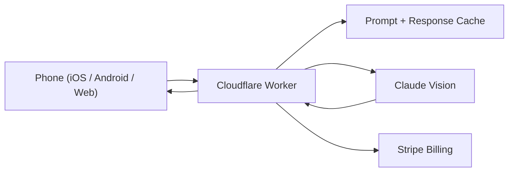

## What it is

A mobile-first identification app. The user takes a photo, the app calls Claude Vision behind a Cloudflare Worker, and the answer comes back in seconds - with provenance, confidence, and a "why I think this" rationale.

## How it works

## What's interesting about it

- **Edge-first.** The Worker is the only thing the phone talks to. No origin server, no warm-pool problem, no cold-start tax.
- **Prompt caching.** Repeated prompts hit the cache. Cost per identification is a fraction of the naive call pattern.
- **Adversarial protection.** Cheap heuristics catch the obvious "is this trying to break out of the prompt" attempts before they hit the model.
- **Solo end-to-end.** Edge architecture, mobile, billing, store deployment - the whole stack is one engineer's work.

## Status

Live on App Store, Google Play, and the open web. Real users, real Stripe billing, real Cloudflare bill - the AI cost story actually has to work.
