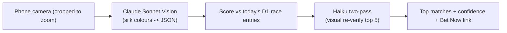

## What it is

A Cloudflare-native PWA for South African horse racing: photograph a jockey's silks at the track, and Claude Vision identifies the colours and pattern, scores them against every entry on today's race card, and returns the top matches with confidence scores, horse and jockey details, and a direct link to bet on that exact race.

## How it works

## What I optimised for

- **A two-pass vision check, not a single guess.** Sonnet extracts structured silk colours first; Haiku then visually compares the photo against the top-5 candidates' real thumbnails before anything is returned - confidence is √(vision confidence) × match score, capped and honest.
- **The one tap that matters.** "BET NOW" doesn't link to the meeting - it links to the exact race with that horse, on Hollywoodbets.
- **Privacy by default.** Uploaded images are deleted immediately after identification, IPs are SHA-256 hashed before storage, EXIF is stripped client-side, and there's an 18+ gate on first visit - POPIA-conscious from day one.

## Status

Live and gated (invite-only registration, Cloudflare Turnstile, per-IP rate limiting) at [silkspotter.net](https://silkspotter.net). A daily scrape keeps race entries and silk data current; the admin panel tracks coverage per meeting and per race.
