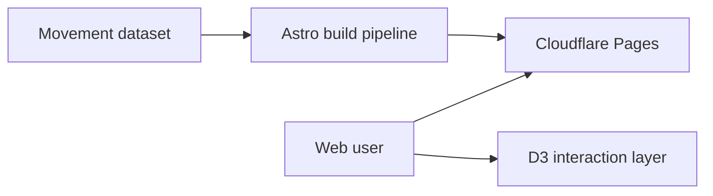

## What it is

A small interactive visualisation of seasonal animal movement data. Dark, minimal, quiet. The kind of map that's pleasant to scroll past on a Tuesday afternoon.

## How it works

## What's interesting about it

- **Dark-first.** The palette is dark by default. It's easier on the eyes for an information-dense map and forces every other design choice to be careful.
- **Restraint.** There's exactly one accent colour. No gradients, no glow effects, no animation past what the data needs.

## Status

Live on the open web. A design exercise as much as a product.
