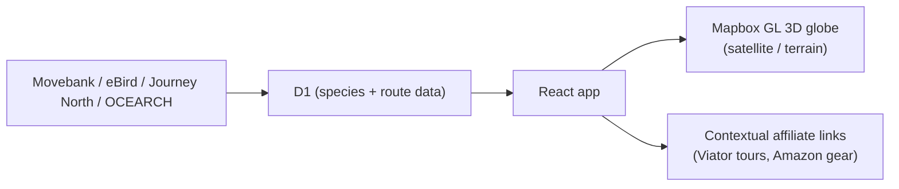

## What it is

An interactive web platform that visualises global wildlife migration on a 3D Mapbox globe: 62 species across six categories, animated migration routes, seasonal timing, and conservation context (IUCN status, viewing tips) - aggregating real tracking and citizen-science data from Movebank, eBird, Journey North, MiCO, and OCEARCH.

## How it works

## What I optimised for

- **Legibility over spectacle.** 62 species on a 3D globe is a lot of data - satellite/terrain toggle, category filtering, and a species detail panel keep it exploratory rather than overwhelming.
- **Real data, validated before it ships.** An affiliate-link validator checks every Amazon ASIN and image before deploy, run as a required pre-deploy step, not an afterthought.
- **A genuine monetisation angle for a side project.** Viator tour links and Amazon gear recommendations are contextual to the selected species, not generic banner ads.

## Status

Live at [wildlifemigrations.org](https://wildlifemigrations.org). 107 Playwright E2E tests cover the map, search/filter, and accessibility; auto-deploys on push to main via Cloudflare Pages.
