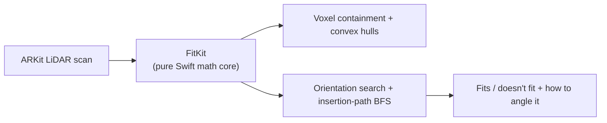

## What it is

A native iOS utility that scans a space once with the phone's LiDAR sensor, then checks whether an object fits into it - including the angle it needs to go in at, not just whether its bounding box is smaller. Built for the recurring real-world question of "will this couch/box/suitcase fit through that door/trunk/gap."

## How it works

## What I optimised for

- **A portable math core.** `FitKit` - voxel containment, convex hulls, orientation search, insertion-path BFS, passage traversal - is deliberately built with zero UIKit/ARKit/SwiftUI dependencies, so the hard geometry logic is testable (100+ tests) independent of the app shell.
- **Real insertion paths, not bounding boxes.** The engine checks whether an object can actually be walked through a passage at some orientation, which is the difference between a useful answer and a naive dimension comparison.
- **No accounts, no cloud, no subscription.** A premium one-time purchase, fully offline - the kind of utility that shouldn't need a login to tell you if your couch fits.

## Status

In active build. The FitKit math core is CI-green with 100+ tests; the SwiftUI app scaffold has every screen navigable with SwiftData models and a Keychain-backed entitlement store. AR scanning, real-device verification, and monetization are next.
